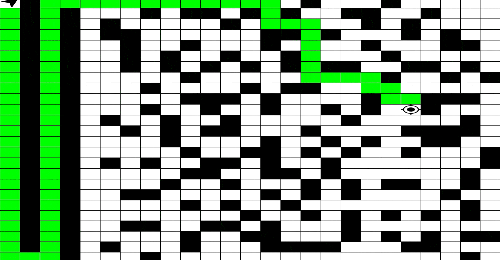

# Exploring A*



A* is one of the most well-known pathfinding algorithms. No matter what type of pathfinding method you use—such as Theta*, Dijkstra’s algorithm, or Jump Point Search—there’s a good chance that some variation of the A* algorithm is involved. In here, we will discuss pathfinding in general, highlight important considerations, and conclude with a simple A* implementation. Stay with me!

---

## Understanding the Search Space

One of the first things we need to consider is the **search space** (the environment in which our pathfinding algorithm operates). The two common types of search spaces are **grid-based search spaces** and **navigation meshes (navmeshes)**.

### Grid Search Space
In a grid-based search space, the environment is divided into a uniform grid, where each cell represents a potential position or node for an entity to move to. Movement is typically restricted to neighboring cells, either in four directions (up, down, left, right) or diagonally. Grid-based systems are simple to implement and are used in many RTS (Real-Time Strategy) games.

### Navigation Mesh (NavMesh)
A **navigation mesh**, or **navmesh**, is a more advanced approach where the environment is divided into interconnected polygons, which represent walkable areas. Entities move across these polygons rather than individual grid cells, allowing for smoother and more realistic movement. Navmeshes are commonly used in 3D games, where more complex terrain needs to be navigated efficiently.

### Multi-Level Pathfinding
Although optimizing your search space is important, it doesn’t solve all pathfinding challenges. We can further improve pathfinding by **dividing it into multiple levels**. 

For example, in large-scale environments (like in real-time strategy games):
- We can use **high-level pathfinding** to find a path between two distant locations, such as between two islands.
- Once the entity reaches the target island, a **lower-level pathfinding algorithm** can be used to navigate to the exact destination within that island.

*(e.g., used in games like **Company of Heroes**.)*


---

## How A* Works

At its core, A* uses two key values for each node (let’s call the node `n`):

- **G(n)**: The cost of the path from the starting node to the current node. It represents the actual travel cost to reach this node. For the starting node, `G(n)` is 0. For any subsequent node, it is calculated as the cost to reach the parent node plus the cost from the parent node to the current node.
- **H(n)**: An estimate (or heuristic) of the distance or cost from the current node to the goal. In most cases, a simple straight-line distance (Euclidean or Manhattan) between the current node and the goal is used as the heuristic.
- **F(n) = G(n) + H(n)**: This is the total cost function that A* uses to prioritize nodes. It balances the cost of reaching the node from the start (`G(n)`) with the estimated cost to reach the goal (`H(n)`). The node with the lowest `F(n)` is considered the most promising to explore next.

### Steps of the A* Algorithm:

1. **Initialization**  
   A* starts by placing the initial node (the starting point) into an open list, which contains nodes that are yet to be fully evaluated. It also uses a closed list to keep track of nodes that have already been visited.

2. **Node Selection**  
   In each iteration, A* selects the node from the open list with the lowest `F(n)` value and moves it to the closed list.

3. **Neighbor Evaluation**  
   The algorithm then examines all neighboring nodes of the selected node, calculating their `G(n)`, `H(n)`, and `F(n)` values. If a neighboring node isn’t already in the closed list, it is added to the open list for future evaluation.

4. **Goal Detection**  
   This process continues until the algorithm finds the goal node. At that point, it traces the path back from the goal to the start, reconstructing the shortest route.


---

## Optimizing A* for Performance

Before we get to the code, there are additional optimizations we can apply to A*, such as adding a weight to the heuristic H(n), resulting in the formula:

**F(n) = G(n) + Weight * H(n)**

- When the **weight is set to 0**, the algorithm behaves like **Dijkstra’s algorithm**, focusing only on the actual cost traveled and ignoring the heuristic.
- When the **weight is 1**, we get the **standard A\***, balancing the travel cost with the estimated distance to the goal.
- For any **weight greater than 1**, the algorithm becomes more like **Greedy Best-First Search**, which prioritizes reaching the goal quickly by relying more heavily on the heuristic. 

Although this can speed up pathfinding, it sacrifices **optimality**, potentially finding a faster but suboptimal path.

By adjusting the weight, you can control whether A* emphasizes **optimality** or **speed**, depending on the needs of your application.

> **Tip:** What we've discussed here is just a tip of the iceberg when it comes to designing pathfinding systems. Depending on the specific problem, there are always more ways to optimize and refine the approach—and that’s part of what makes it so exciting!


---

## Spatial Hashing

Before starting to develop our A* algorithm, we need some data structures and containers. One common technique is **spatial hashing**.

Spatial hashing divides space into a grid of cells and assigns objects to these cells based on their position. This allows for efficient lookups based on location.

Here you can find the header file of our spatial Hash2d.

```cpp
class SpatialHash2d {
protected:
    std::unordered_multimap<uint32_t, uint32_t> mHash;
    GridIndexer2d mIndexer;

public:
    SpatialHash2d(uint8_t gridSize, uint16_t cellSize);

    void InsertPoint(uint32_t pointID, const Vector2d &location);
    bool RemovePoint(uint32_t pointID, const Vector2d &location);
    bool RemovePoint(uint32_t indexId, uint32_t pointID);
    bool UpdatePoint(uint32_t pointID, const Vector2d &oldLocation, const Vector2d &currentLocation);
    std::vector<uint32_t> GetAllPoints(const Vector2d &position);

    std::array<std::optional<uint32_t>, 4> GetNeighbours(const Vector2d &position);

    uint32_t GetGridId(Vector2d position) const;
    Vector2d GetGridFrom(uint32_t gridId);

    bool HasPoint(uint32_t gridId);

    uint16_t GetCellSize();
};

```

> **Tip:** Vector2d is used to handle 2D location data. Vertex is used for storing A* nodes, including their parent, G, and H values. PathLinkedList is a linked list structure that holds our path results.


# A* Algorithm Implementation

Now that we know how it works, let's quickly explain some of the main logic that you may encounter in the source code. I recommend exploring the codebase to see the full implementation.

First, we get the variable with the lowest F from the open IDs:

```cpp
    while (!mOpenIDs.empty()) {
        const uint32_t NewPoppedGridId = mOpenIDs.top().second;
        mOpenIDs.pop();
        auto currentVertex = mVertexes.find(NewPoppedGridId);
    }
```
Then, we check if the newly popped variable is the same as the end node. If it is, we stop searching:
```cpp
        if (NewPoppedGridId == mEndGridId) {
            break;
        }
```
We push the newly popped variable to the closed list, then get all the neighbors. If the neighbor isn't in the closed list, we add it to our vertex pool and evaluate the G, H, and F values:
```cpp
        mCloses.insert(currentVertex->second.gridId);
        for (const uint32_t NeighbourId: mObjectsManager->GetUnblockedNeighbours(currentVertex->second.GetLocation())) {
            if (mCloses.find(NeighbourId) != mCloses.end()) {
                continue;
            }
            if (mOpens.find(NeighbourId) == mOpens.end()) {
                AddToVertexes(mObjectsManager->GetGridFrom(NeighbourId));
            }
            UpdateVertex(mVertexes.find(NeighbourId)->second, currentVertex->second);
        }
```
In our CalculateAndUpdateG, we calculate the new G by adding the parent's G with the distance between the node and its parent:
```cpp
   double newG = newParent.g + vertex.GetLocation().Distance(newParent.GetLocation());
    if (newG < vertex.g) {
        vertex.g = newG;
        vertex.parent = newParent.gridId;
    }
```
